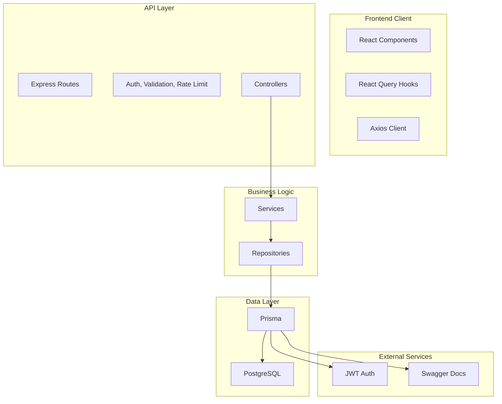
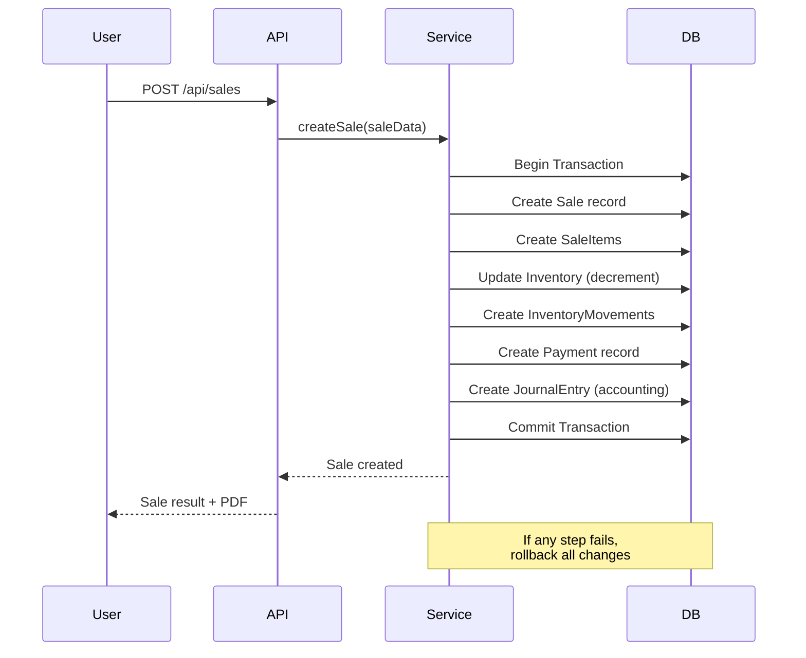

# Backend Architecture Design - SimplePOS

## 🎯 Visión General

Este documento detalla la arquitectura completa del backend para SimplePOS, incluyendo PostgreSQL, API REST, y la integración con el frontend existente.

---

## 🏗️ Arquitectura de Capas



---

## 📁 Estructura del Proyecto

```
SIMPLEPOS/
├── server/                          # Backend Root
│   ├── src/
│   │   ├── index.ts                 # Entry point
│   │   ├── app.ts                   # Express app setup
│   │   ├── config/
│   │   │   ├── database.ts          # Prisma client
│   │   │   ├── env.ts               # Environment variables
│   │   │   └── swagger.ts           # Swagger setup
│   │   ├── middlewares/
│   │   │   ├── auth.ts              # JWT authentication
│   │   │   ├── errorHandler.ts      # Global error handling
│   │   │   ├── rateLimiter.ts       # Rate limiting
│   │   │   └── validation.ts       # Request validation
│   │   ├── routes/
│   │   │   ├── auth.routes.ts       # Auth endpoints
│   │   │   ├── users.routes.ts      # Users CRUD
│   │   │   ├── products.routes.ts   # Products CRUD
│   │   │   ├── sales.routes.ts      # Sales CRUD
│   │   │   ├── inventory.routes.ts  # Inventory operations
│   │   │   ├── customers.routes.ts  # Customers CRUD
│   │   │   ├── suppliers.routes.ts  # Suppliers CRUD
│   │   │   ├── accounting.routes.ts # Accounting operations
│   │   │   └── banks.routes.ts      # Banks/Caja operations
│   │   ├── controllers/
│   │   │   ├── auth.controller.ts
│   │   │   ├── users.controller.ts
│   │   │   ├── products.controller.ts
│   │   │   ├── sales.controller.ts
│   │   │   ├── inventory.controller.ts
│   │   │   ├── customers.controller.ts
│   │   │   ├── suppliers.controller.ts
│   │   │   ├── accounting.controller.ts
│   │   │   └── banks.controller.ts
│   │   ├── services/
│   │   │   ├── auth.service.ts
│   │   │   ├── users.service.ts
│   │   │   ├── products.service.ts
│   │   │   ├── sales.service.ts
│   │   │   └── ...
│   │   ├── repositories/
│   │   │   ├── user.repository.ts
│   │   │   ├── product.repository.ts
│   │   │   ├── sale.repository.ts
│   │   │   └── ...
│   │   ├── utils/
│   │   │   ├── helpers.ts
│   │   │   ├── constants.ts
│   │   │   └── types.ts
│   │   └── dto/                      # Data Transfer Objects
│   │       ├── user.dto.ts
│   │       ├── product.dto.ts
│   │       └── ...
│   ├── prisma/
│   │   ├── schema.prisma            # Database schema
│   │   ├── migrations/              # Migrations
│   │   └── seed.ts                  # Seed data
│   ├── .env                         # Environment variables
│   ├── .env.example
│   ├── package.json
│   ├── tsconfig.json
│   └── README.md
│
├── src/                             # Frontend (existing)
│   └── ...
│
└── docs/
    └── API_DOCS.md
```

---

## 🗄️ Esquema de Base de Datos PostgreSQL

```prisma
// prisma/schema.prisma

generator client {
  provider = "prisma-client-js"
}

datasource db {
  provider = "postgresql"
  url      = env("DATABASE_URL")
}

// ==================== USER & AUTH ====================

model Role {
  id          String   @id @default(uuid())
  name        String   @unique
  description String?
  users       User[]
  createdAt   DateTime @default(now())
  updatedAt   DateTime @updatedAt
}

model User {
  id            String    @id @default(uuid())
  username      String    @unique
  email         String    @unique
  passwordHash String
  roleId        String
  role          Role      @relation(fields: [roleId], references: [id])
  isActive      Boolean   @default(true)
  lastLogin     DateTime?
  createdAt     DateTime  @default(now())
  updatedAt     DateTime  @updatedAt
  
  sales         Sale[]
  expenses      Expense[]
  cashMovements CashMovement[]
  
  @@index([email])
  @@index([username])
}

// ==================== CUSTOMERS ====================

model Customer {
  id           String   @id @default(uuid())
  name         String
  email        String   @unique
  nit          String   @unique
  phone        String?
  address      String?
  isActive     Boolean  @default(true)
  createdAt    DateTime @default(now())
  updatedAt    DateTime @updatedAt
  
  sales        Sale[]
  
  @@index([nit])
  @@index([email])
}

// ==================== SUPPLIERS ====================

model Supplier {
  id            String   @id @default(uuid())
  name          String   @unique
  contactPerson String?
  phone         String?
  email         String?
  address       String?
  isActive      Boolean  @default(true)
  createdAt     DateTime @default(now())
  updatedAt     DateTime @updatedAt
  
  purchases     Purchase[]
  
  @@index([name])
}

// ==================== CATEGORIES ====================

model Category {
  id          String    @id @default(uuid())
  name        String    @unique
  description String?
  createdAt   DateTime  @default(now())
  updatedAt   DateTime  @updatedAt
  
  products    Product[]
}

// ==================== PRODUCTS ====================

model Product {
  id           String   @id @default(uuid())
  name         String
  description  String?
  sku          String   @unique
  price        Decimal  @db.Decimal(10, 2)
  costPrice    Decimal? @db.Decimal(10, 2)
  categoryId   String
  category     Category @relation(fields: [categoryId], references: [id])
  imageUrl     String?
  isActive     Boolean  @default(true)
  createdAt    DateTime @default(now())
  updatedAt    DateTime @updatedAt
  
  inventory    InventoryItem[]
  saleItems    SaleItem[]
  purchaseItems PurchaseItem[]
  
  @@index([sku])
  @@index([name])
  @@index([categoryId])
}

// ==================== WAREHOUSES ====================

model Warehouse {
  id        String   @id @default(uuid())
  name      String   @unique
  location  String?
  isDefault Boolean  @default(false)
  createdAt DateTime @default(now())
  updatedAt DateTime @updatedAt
  
  inventory InventoryItem[]
  cashMovements CashMovement[]
  
  @@index([name])
}

// ==================== INVENTORY ====================

model InventoryItem {
  id           String   @id @default(uuid())
  productId    String
  product      Product  @relation(fields: [productId], references: [id])
  warehouseId  String
  warehouse    Warehouse @relation(fields: [warehouseId], references: [id])
  quantity     Int      @default(0)
  minStock     Int      @default(0)
  maxStock     Int      @default(1000)
  createdAt    DateTime @default(now())
  updatedAt    DateTime @updatedAt
  
  @@unique([productId, warehouseId])
  @@index([productId])
  @@index([warehouseId])
}

model InventoryMovement {
  id              String    @id @default(uuid())
  productId       String
  warehouseId     String
  movementType    String    // IN, OUT, ADJUST, TRANSFER
  quantity        Int
  previousQty     Int
  newQty          Int
  referenceId     String?   // Sale ID, Purchase ID, etc.
  referenceType   String?   // 'SALE', 'PURCHASE', 'ADJUSTMENT'
  notes           String?
  userId          String
  createdAt       DateTime  @default(now())
  
  @@index([productId])
  @@index([warehouseId])
  @@index([createdAt])
}

// ==================== SALES ====================

model Sale {
  id            String     @id @default(uuid())
  invoiceNumber String     @unique
  customerId    String
  customer      Customer   @relation(fields: [customerId], references: [id])
  userId        String
  user          User       @relation(fields: [userId], references: [id])
  subtotal      Decimal    @db.Decimal(12, 2)
  tax           Decimal    @db.Decimal(12, 2) @default(0)
  discount      Decimal    @db.Decimal(12, 2) @default(0)
  total         Decimal    @db.Decimal(12, 2)
  status        String     @default("COMPLETED") // PENDING, COMPLETED, CANCELLED, REFUNDED
  notes         String?
  createdAt     DateTime   @default(now())
  updatedAt     DateTime   @updatedAt
  
  items         SaleItem[]
  payments      Payment[]
  
  @@index([invoiceNumber])
  @@index([customerId])
  @@index([userId])
  @@index([createdAt])
  @@index([status])
}

model SaleItem {
  id         String   @id @default(uuid())
  saleId     String
  sale       Sale     @relation(fields: [saleId], references: [id])
  productId  String
  product    Product  @relation(fields: [productId], references: [id])
  quantity   Int
  unitPrice  Decimal  @db.Decimal(10, 2)
  subtotal   Decimal  @db.Decimal(12, 2)
  createdAt  DateTime @default(now())
  
  @@index([saleId])
  @@index([productId])
}

// ==================== PURCHASES ====================

model Purchase {
  id            String   @id @default(uuid())
  invoiceNumber String   @unique
  supplierId    String
  supplier      Supplier @relation(fields: [supplierId], references: [id])
  subtotal      Decimal  @db.Decimal(12, 2)
  tax           Decimal  @db.Decimal(12, 2) @default(0)
  total         Decimal  @db.Decimal(12, 2)
  status        String   @default("RECEIVED") // PENDING, ORDERED, RECEIVED, CANCELLED
  notes         String?
  createdAt     DateTime @default(now())
  updatedAt     DateTime @updatedAt
  
  items         PurchaseItem[]
  
  @@index([invoiceNumber])
  @@index([supplierId])
  @@index([createdAt])
}

model PurchaseItem {
  id         String   @id @default(uuid())
  purchaseId String
  purchase   Purchase @relation(fields: [purchaseId], references: [id])
  productId  String
  product    Product  @relation(fields: [productId], references: [id])
  quantity   Int
  unitCost   Decimal  @db.Decimal(10, 2)
  subtotal   Decimal  @db.Decimal(12, 2)
  createdAt  DateTime @default(now())
  
  @@index([purchaseId])
  @@index([productId])
}

// ==================== BANKING & CASH ====================

model BankAccount {
  id           String   @id @default(uuid())
  name         String   @unique
  accountType  String   // CHECKING, SAVINGS, CREDIT
  bankName     String?
  accountNumber String?
  currentBalance Decimal @db.Decimal(12, 2) @default(0)
  isActive     Boolean  @default(true)
  createdAt    DateTime @default(now())
  updatedAt    DateTime @updatedAt
  
  transactions BankTransaction[]
  
  @@index([name])
}

model BankTransaction {
  id             String   @id @default(uuid())
  bankAccountId  String
  bankAccount    BankAccount @relation(fields: [bankAccountId], references: [id])
  type           String   // DEPOSIT, WITHDRAWAL, TRANSFER, PAYMENT
  amount         Decimal  @db.Decimal(12, 2)
  description    String?
  referenceId    String?
  referenceType  String?
  date           DateTime @default(now())
  createdAt      DateTime @default(now())
  
  @@index([bankAccountId])
  @@index([date])
}

model CashBox {
  id        String   @id @default(uuid())
  name      String   @unique
  isOpen    Boolean  @default(false)
  openingBalance Decimal @db.Decimal(12, 2) @default(0)
  currentBalance Decimal @db.Decimal(12, 2) @default(0)
  openedAt  DateTime?
  closedAt  DateTime?
  createdAt DateTime @default(now())
  updatedAt DateTime @updatedAt
  
  movements CashMovement[]
  
  @@index([isOpen])
}

model CashMovement {
  id          String   @id @default(uuid())
  cashBoxId   String
  cashBox     CashBox  @relation(fields: [cashBoxId], references: [id])
  type        String   // IN, OUT
  amount      Decimal  @db.Decimal(12, 2)
  category    String   // SALE, EXPENSE, ADJUSTMENT, TRANSFER
  description String?
  userId      String
  user        User     @relation(fields: [userId], references: [id])
  createdAt   DateTime @default(now())
  
  @@index([cashBoxId])
  @@index([createdAt])
}

// ==================== EXPENSES ====================

model ExpenseCategory {
  id          String   @id @default(uuid())
  name        String   @unique
  description String?
  isActive    Boolean  @default(true)
  createdAt   DateTime @default(now())
  updatedAt   DateTime @updatedAt
  
  expenses    Expense[]
}

model Expense {
  id        String   @id @default(uuid())
  categoryId String
  category  ExpenseCategory @relation(fields: [categoryId], references: [id])
  amount    Decimal  @db.Decimal(12, 2)
  description String
  date      DateTime @default(now())
  userId    String
  user      User     @relation(fields: [userId], references: [id])
  createdAt DateTime @default(now())
  updatedAt DateTime @updatedAt
  
  @@index([categoryId])
  @@index([date])
}

// ==================== ACCOUNTING ====================

model Account {
  id          String   @id @default(uuid())
  code        String   @unique
  name        String   @unique
  accountType String   // ASSET, LIABILITY, EQUITY, REVENUE, EXPENSE
  parentId    String?
  parent      Account? @relation("AccountHierarchy", fields: [parentId], references: [id])
  children    Account[] @relation("AccountHierarchy")
  balance     Decimal  @db.Decimal(14, 2) @default(0)
  isActive    Boolean  @default(true)
  createdAt   DateTime @default(now())
  updatedAt   DateTime @updatedAt
  
  journalEntries JournalEntryDetail[]
  
  @@index([code])
  @@index([accountType])
}

model JournalEntry {
  id          String   @id @default(uuid())
  entryNumber String   @unique
  date        DateTime @default(now())
  description String?
  status      String   @default("DRAFT") // DRAFT, POSTED, CANCELLED
  createdAt   DateTime @default(now())
  updatedAt   DateTime @updatedAt
  
  details     JournalEntryDetail[]
  
  @@index([entryNumber])
  @@index([date])
  @@index([status])
}

model JournalEntryDetail {
  id              String   @id @default(uuid())
  journalEntryId  String
  journalEntry    JournalEntry @relation(fields: [journalEntryId], references: [id])
  accountId       String
  account         Account  @relation(fields: [accountId], references: [id])
  debit           Decimal  @db.Decimal(14, 2) @default(0)
  credit          Decimal  @db.Decimal(14, 2) @default(0)
  description     String?
  createdAt       DateTime @default(now())
  
  @@index([journalEntryId])
  @@index([accountId])
}

// ==================== SETTINGS ====================

model Setting {
  id        String   @id @default(uuid())
  key       String   @unique
  value     String
  type      String   @default("STRING") // STRING, NUMBER, BOOLEAN, JSON
  createdAt DateTime @default(now())
  updatedAt DateTime @updatedAt
  
  @@index([key])
}
```

---

## 🔐 Sistema de Autenticación JWT

```typescript
// Estructura del JWT Token
interface JWTPayload {
  userId: string;
  email: string;
  role: string;
  iat: number;
  exp: number;
}

// Flow de autenticación:
1. POST /api/auth/login { email, password }
// {
//   "accessToken": "eyJhbGciOiJIUzI1NiIs...",
//   "refreshToken": "eyJhbGciOiJIUzI1NiIs...",
//   "user": { id, email, role, ... }
// }

2. Access Token expira en 15 minutos
3. Refresh Token expira en 7 días
4. POST /api/auth/refresh { refreshToken } // Obtener nuevo access token
5. POST /api/auth/logout // Invalidar refresh token
```

---

## 📡 API Endpoints

### Authentication
| Method | Endpoint | Description | Auth |
|--------|----------|-------------|------|
| POST | /api/auth/register | Register new user | Public |
| POST | /api/auth/login | Login | Public |
| POST | /api/auth/refresh | Refresh token | Public |
| POST | /api/auth/logout | Logout | Required |
| GET | /api/auth/me | Get current user | Required |

### Users
| Method | Endpoint | Description | Auth |
|--------|----------|-------------|------|
| GET | /api/users | List all users | Admin |
| GET | /api/users/:id | Get user by ID | Admin |
| POST | /api/users | Create user | Admin |
| PUT | /api/users/:id | Update user | Admin |
| DELETE | /api/users/:id | Delete user | Admin |
| PUT | /api/users/:id/role | Update user role | Admin |

### Products
| Method | Endpoint | Description | Auth |
|--------|----------|-------------|------|
| GET | /api/products | List products (paginated, filtered) | Required |
| GET | /api/products/:id | Get product by ID | Required |
| POST | /api/products | Create product | Required |
| PUT | /api/products/:id | Update product | Required |
| DELETE | /api/products/:id | Delete product | Required |
| GET | /api/products/sku/:sku | Get by SKU | Required |
| GET | /api/products/category/:categoryId | Get by category | Required |

### Sales
| Method | Endpoint | Description | Auth |
|--------|----------|-------------|------|
| GET | /api/sales | List sales (paginated, filtered) | Required |
| GET | /api/sales/:id | Get sale by ID | Required |
| POST | /api/sales | Create sale | Required |
| PUT | /api/sales/:id | Update sale | Required |
| PUT | /api/sales/:id/status | Update status | Required |
| POST | /api/sales/:id/refund | Refund sale | Required |
| GET | /api/sales/report/daily | Daily report | Required |
| GET | /api/sales/report/period | Period report | Required |

### Inventory
| Method | Endpoint | Description | Auth |
|--------|----------|-------------|------|
| GET | /api/inventory | Get inventory levels | Required |
| GET | /api/inventory/warehouse/:id | Inventory by warehouse | Required |
| POST | /api/inventory/adjust | Adjust inventory | Required |
| POST | /api/inventory/transfer | Transfer between warehouses | Required |
| GET | /api/inventory/movements | List movements | Required |
| GET | /api/inventory/alerts | Low stock alerts | Required |

### Customers
| Method | Endpoint | Description | Auth |
|--------|----------|-------------|------|
| GET | /api/customers | List customers | Required |
| GET | /api/customers/:id | Get customer by ID | Required |
| POST | /api/customers | Create customer | Required |
| PUT | /api/customers/:id | Update customer | Required |
| DELETE | /api/customers/:id | Delete customer | Required |
| GET | /api/customers/:id/history | Purchase history | Required |

### Accounting
| Method | Endpoint | Description | Auth |
|--------|----------|-------------|------|
| GET | /api/accounting/accounts | Chart of accounts | Required |
| POST | /api/accounting/accounts | Create account | Required |
| GET | /api/accounting/journal | Journal entries | Required |
| POST | /api/accounting/journal | Create journal entry | Required |
| POST | /api/accounting/journal/:id/post | Post entry | Required |
| GET | /api/accounting/balance | Trial balance | Required |
| GET | /api/accounting/financial-statement | Financial statements | Required |

### Banks & Cash
| Method | Endpoint | Description | Auth |
|--------|----------|-------------|------|
| GET | /api/banks/accounts | List bank accounts | Required |
| POST | /api/banks/accounts | Create bank account | Required |
| GET | /api/banks/transactions | List transactions | Required |
| POST | /api/banks/transactions | Create transaction | Required |
| GET | /api/cash | Cash box status | Required |
| POST | /api/cash/open | Open cash box | Required |
| POST | /api/cash/close | Close cash box | Required |
| POST | /api/cash/movement | Cash movement | Required |

---

## 🔄 Flujo de una Venta



---

## 🛡️ Seguridad

### Rate Limiting
```typescript
// Límites por endpoint
- Auth endpoints: 5 requests/minute
- General API: 100 requests/minute
- File uploads: 10 requests/minute
```

### Validation (Zod)
```typescript
// Example: Product creation schema
const createProductSchema = z.object({
  name: z.string().min(1).max(255),
  sku: z.string().min(1).max(50),
  price: z.number().positive(),
  costPrice: z.number().optional(),
  categoryId: z.string().uuid(),
  description: z.string().optional(),
});
```

### Error Handling
```typescript
// Códigos de error
400 - Bad Request (validation error)
401 - Unauthorized
403 - Forbidden
404 - Not Found
409 - Conflict (duplicate)
422 - Unprocessable Entity
500 - Internal Server Error
```

---

## 🚀 Scripts de Desarrollo

```json
{
  "scripts": {
    "dev": "tsx watch src/index.ts",
    "build": "tsc",
    "start": "node dist/index.js",
    "db:generate": "prisma generate",
    "db:push": "prisma db push",
    "db:migrate": "prisma migrate dev",
    "db:migrate:prod": "prisma migrate deploy",
    "db:seed": "tsx prisma/seed.ts",
    "db:studio": "prisma studio",
    "lint": "eslint src/**/*.ts",
    "test": "vitest"
  }
}
```

---

## 📋 Integración con Frontend

### Estructura de hooks

```
src/
├── hooks/
│   ├── useAuth.ts
│   │   ├── login()
│   │   ├── logout()
│   │   ├── refreshToken()
│   │   └── useUser()
│   ├── useProducts.ts
│   │   ├── useProducts(query)
│   │   ├── useProduct(id)
│   │   ├── createProduct()
│   │   ├── updateProduct()
│   │   └── deleteProduct()
│   ├── useSales.ts
│   │   ├── useSales(filters)
│   │   ├── useSale(id)
│   │   ├── createSale()
│   │   └── refundSale()
│   └── useInventory.ts
│       ├── useInventory(warehouseId)
│       └── adjustInventory()
```

### API Client Configuration

```typescript
// src/api/client.ts
import axios from 'axios';

const api = axios.create({
  baseURL: import.meta.env.VITE_API_URL,
  timeout: 30000,
});

// Request interceptor
api.interceptors.request.use(
  (config) => {
    const token = localStorage.getItem('accessToken');
    if (token) {
      config.headers.Authorization = `Bearer ${token}`;
    }
    return config;
  },
  (error) => Promise.reject(error)
);

// Response interceptor (token refresh)
api.interceptors.response.use(
  (response) => response,
  async (error) => {
    if (error.response?.status === 401) {
      // Try refresh token
      const refreshToken = localStorage.getItem('refreshToken');
      if (refreshToken) {
        try {
          const response = await axios.post('/api/auth/refresh', { refreshToken });
          const { accessToken } = response.data;
          localStorage.setItem('accessToken', accessToken);
          error.config.headers.Authorization = `Bearer ${accessToken}`;
          return axios(error.config);
        } catch {
          // Refresh failed, logout
          localStorage.removeItem('accessToken');
          localStorage.removeItem('refreshToken');
          window.location.href = '/login';
        }
      }
    }
    return Promise.reject(error);
  }
);

export default api;
```
