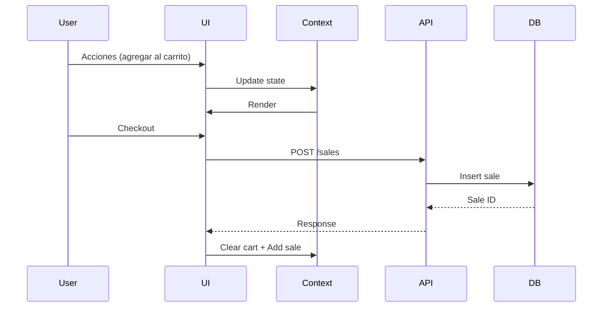

# Plan de Arquitectura - SimplePOS

## 📊 Estado Actual del Proyecto

### ✅ Lo que ya está implementado:

| Módulo | Estado | Descripción |
|--------|--------|-------------|
| Frontend | ✅ Completo | React + TypeScript + Vite + Tailwind |
| Layout/Navegación | ✅ Completo | Sidebar responsive con navegación |
| POS | ✅ Funcional | Carrito, búsqueda, checkout, PDFs |
| Inventory | ✅ Funcional | CRUD productos (localStorage) |
| Accounting | ⚠️ Parcial | Gráficos + IA analysis |
| Banks | ⚠️ Esqueleto | Solo UI básica |
| IA Integration | ✅ Funcional | Gemini para emails y análisis |
| PDF Generation | ✅ Funcional | Receipts y facturas |

### ⏸️ Lo que necesita implementación:

1. **Backend/API** - Sin conexión a base de datos real
2. **Autenticación** - No hay sistema de login
3. **Persistencia** - Solo localStorage
4. **Completar módulos** - Accounting y Banks

---

## 🎯 Próximos Pasos Recomendados

### Fase 1: Backend y Base de Datos

```
1.1 Implementar API con Node.js/Express o Python/FastAPI
     ├── Conectar a PostgreSQL (usar schema existente)
     ├── CRUD endpoints para productos, ventas, usuarios
     └── Middleware de autenticación

1.2 Implementar autenticación JWT
     ├── Login/Register
     ├── Roles (admin, vendedor, contador)
     └── Sesiones seguras

1.3 Refactorizar frontend para usar API
     ├── Reemplazar localStorage por llamadas API
     ├── Manejo de estados de carga/error
     └── Optimistic updates
```

### Fase 2: Completar Módulos

```
2.1 Accounting - Completar funcionalidades
     ├── Reportes financieros
     ├── Gestión de cuentas contables
     ├── Libro mayor
     └── Estados financieros básicos

2.2 Banks - Implementar funcionalidades
     ├── Registro de movimientos de caja
     ├── Conciliación bancaria
     ├── Gastos e ingresos
     └── Balance de caja

2.3 Customers - Gestión completa
     ├── CRUD clientes
     ├── Historial de compras
     └── Segmentación
```

### Fase 3: Mejoras y Escalabilidad

```
3.1 Offline Mode
     ├── Service Worker
     ├── Sync cuando hay conexión
     └── Conflict resolution

3.2 Reportes Avanzados
     ├── Exportar PDF/Excel
     ├── Dashboard customizable
     └── KPIs personalizados

3.3 Multi-dispositivo
     ├── Responsive avanzado
     ├── PWA
     └── Modo offline
```

---

## 🏗️ Arquitectura Propuesta

```mermaid
graph TB
    subgraph Frontend
        UI[React UI] --> State[Store Context]
        State --> API[API Layer]
    end
    
    subgraph Backend
        API --> Routes[Express Routes]
        Routes --> Controllers
        Controllers --> Services
        Services --> DB[(PostgreSQL)]
    end
    
    subgraph External Services
        Controllers --> Gemini[Google Gemini API]
        Controllers --> PDF[PDF Generator]
    end
    
    subgraph Auth
        Routes --> Auth[JWT Auth]
        Auth --> DB
    end
```

---

## 📁 Estructura de Archivos Propuesta

```
src/
├── api/                    # Llamadas al backend
│   ├── api.ts             # Axios instance
│   ├── products.ts
│   ├── sales.ts
│   ├── auth.ts
│   └── customers.ts
├── components/
│   ├── POS.tsx
│   ├── Inventory.tsx
│   ├── Accounting.tsx
│   ├── Banks.tsx
│   └── ...
├── context/
│   └── StoreContext.tsx   # Refactorizar para API
├── hooks/                  # Custom hooks
│   ├── useAuth.ts
│   ├── useProducts.ts
│   └── useSales.ts
├── pages/                  # Si se usa routing
├── services/
│   └── ...
└── types/
    └── ...

server/
├── src/
│   ├── index.ts
│   ├── routes/
│   ├── controllers/
│   ├── services/
│   ├── models/
│   ├── middleware/
│   └── config/
└── database/
    ├── init.sql
    └── migrations/
```

---

## 🔄 Flujo de Datos Propuesto



---

## ❓ Preguntas para Clarificar

Antes de continuar, algunas preguntas importantes:

1. **Backend**: ¿Prefieres Node.js/Express o Python/FastAPI para el backend?

2. **Auth**: ¿Necesitas múltiples usuarios con roles diferentes o será single-user?

3. **Offline**: ¿Es importante el modo offline o puede ser always-online?

4. **Hosting**: ¿Tienes preferencia por dónde hostear (Vercel, Railway, VPS, etc.)?

5. **Prioridad**: ¿Qué módulo es más urgente completar: Accounting, Banks, o la conexión a base de datos?
